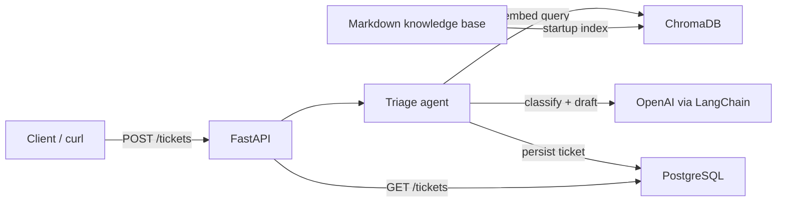

# CloudLedger Ticket Triage (RAG)

A local demo of a support-ticket triage system that uses **Retrieval-Augmented Generation (RAG)** to classify incoming tickets, draft answers from a product knowledge base, and escalate to a human when confidence is low.

Built as a portfolio project: small surface area, clear structure, fully runnable with Docker Compose.

## Problem statement

Support teams drown in repetitive questions that already exist in docs (billing, login, API errors, refunds). A plain LLM call can invent answers or sound confident when it should escalate. This project shows a safer pattern:

1. Retrieve relevant doc chunks from a vector store
2. Ask the model to classify + score confidence against that context
3. Auto-draft a reply only when confidence clears a threshold
4. Otherwise mark the ticket `needs_human_review` and keep the reasoning for an agent

## Architecture



| Service   | Role                                      |
|-----------|-------------------------------------------|
| `api`     | FastAPI app: triage, health, ticket CRUD  |
| `chromadb`| Local vector store (persisted volume)     |
| `postgres`| Tickets, status, reasoning, responses     |

### Project layout

```
app/
  api/       # HTTP routes (/health, /tickets)
  rag/       # embedding + retrieval
  agent/     # classification + response generation
  models/    # SQLAlchemy + Pydantic schemas
knowledge_base/   # 15 CloudLedger FAQ/docs (seeded)
```

## Setup

Prerequisites: Docker + Docker Compose.

```bash
cp .env.example .env
# edit .env and set OPENAI_API_KEY=sk-...

docker compose up --build
```

That is the full setup. On boot the API:

1. Creates Postgres tables
2. Waits for ChromaDB
3. Embeds and indexes all `knowledge_base/*.md` files (skipped if the collection already has documents)

API base URL: `http://localhost:8000`  
Interactive docs: `http://localhost:8000/docs`

## Example requests

### Health

```bash
curl -s http://localhost:8000/health | jq
```

### High-confidence ticket (should auto-resolve)

```bash
curl -s -X POST http://localhost:8000/tickets \
  -H 'Content-Type: application/json' \
  -d '{
    "subject": "Forgot my password",
    "body": "I cannot log in to CloudLedger and need to reset my password. How do I do that?"
  }' | jq
```

Expected shape: `status` ≈ `auto_resolved`, a `category` like `login`, a `confidence` above the threshold (default `0.7`), and a `suggested_response` grounded in the docs.

### Low-confidence / out-of-scope ticket (should escalate)

```bash
curl -s -X POST http://localhost:8000/tickets \
  -H 'Content-Type: application/json' \
  -d '{
    "subject": "Custom ERP connector",
    "body": "Can you build a real-time bi-directional sync with our on-prem SAP instance and guarantee 50ms latency?"
  }' | jq
```

Expected: `status` = `needs_human_review`, little or no `suggested_response`.

### List and fetch tickets

```bash
curl -s http://localhost:8000/tickets | jq
curl -s http://localhost:8000/tickets/<ticket-uuid> | jq
```

## Configuration

| Variable               | Default                 | Purpose                          |
|------------------------|-------------------------|----------------------------------|
| `OPENAI_API_KEY`       | _(required)_            | Embeddings + triage LLM          |
| `LLM_PROVIDER`         | `openai`                | Provider switch (OpenAI today)   |
| `LLM_MODEL`            | `gpt-4o-mini`           | Chat model                       |
| `EMBEDDING_MODEL`      | `text-embedding-3-small`| Embedding model                  |
| `CONFIDENCE_THRESHOLD` | `0.7`                   | Auto-resolve cutoff              |
| `POSTGRES_*`           | `triage` / `triage`     | Database credentials             |

## Design decisions

### Why RAG instead of a plain LLM call?

A plain prompt has no product ground truth. Models fill gaps with plausible fiction (wrong refund windows, invented API error codes). RAG injects the actual docs into the prompt so answers are attributable to retrieved chunks, which are also stored on the ticket as `retrieved_context` for auditability.

### Why confidence-based escalation?

Automation that is wrong is worse than no automation. The agent returns an explicit confidence score. Below `CONFIDENCE_THRESHOLD`, the system refuses to guess: status becomes `needs_human_review` and any drafted reply is discarded. That keeps the demo honest about when retrieval is weak or the question is out of scope.

### Why this stack?

- **FastAPI** — clear typed API surface for a portfolio demo
- **ChromaDB** — zero-ops local vector store with a Docker volume
- **PostgreSQL** — durable ticket history (not just chat logs)
- **LangChain + OpenAI** — thin orchestration; `LLM_PROVIDER` is isolated so another provider can be plugged in later without rewriting routes

## Knowledge base

Fifteen markdown docs under `knowledge_base/` cover a fictional SaaS called **CloudLedger** (billing, login/SSO, API auth & errors, refunds, expenses, integrations, security, FAQ). Edit or add `.md` files and restart the API with a fresh Chroma volume to re-index:

```bash
docker compose down -v
docker compose up --build
```
