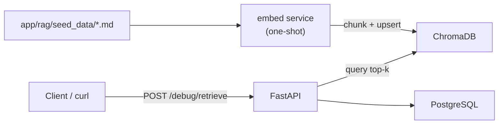

# CloudNova Ticket Triage (RAG)

A local demo of a support-ticket triage system that uses **Retrieval-Augmented Generation (RAG)** to classify incoming tickets, draft answers from a product knowledge base, and escalate to a human when confidence is low.

Built as a portfolio project: small surface area, clear structure, fully runnable with Docker Compose.

> **Current stage: 2 — knowledge-base seeding + retrieval.**  
> Use `POST /debug/retrieve` to inspect chunk quality before the LLM classification stage is wired further.

## Problem statement

Support teams drown in repetitive questions that already exist in docs (billing, login, API errors, FAQs). A plain LLM call can invent answers or sound confident when it should escalate. This project shows a safer pattern:

1. Retrieve relevant doc chunks from a vector store
2. Ask the model to classify + score confidence against that context
3. Auto-draft a reply only when confidence clears a threshold
4. Otherwise mark the ticket `needs_human_review` and keep the reasoning for an agent

## Architecture



| Service    | Role                                                    |
|------------|---------------------------------------------------------|
| `chromadb` | Local vector store (persisted volume)                   |
| `embed`    | One-shot job: chunk + embed seed docs (idempotent)      |
| `postgres` | Ticket persistence (used by later stages /health)       |
| `api`      | FastAPI — starts only after `embed` completes           |

### Project layout

```
app/
  api/                 # /health, /debug/retrieve, /tickets
  rag/
    seed_data/         # 12 CloudNova support markdown docs
    embed.py           # chunk + embed + upsert into ChromaDB
    retrieve.py        # top-k similarity search
  agent/               # (later stage) classification + drafting
  models/              # SQLAlchemy + Pydantic schemas
```

## Setup

Prerequisites: Docker + Docker Compose.

```bash
cp .env.example .env
# optional for stage 2: set OPENAI_API_KEY=sk-...
# without a key, embed falls back to Chroma's local DefaultEmbeddingFunction

docker compose up --build
```

Boot order:

1. `postgres` + `chromadb` become healthy
2. `embed` loads `app/rag/seed_data/*.md`, chunks by heading, upserts into Chroma
3. `api` starts and serves traffic

Re-index after editing seed docs:

```bash
docker compose run --rm embed python -m app.rag.embed --force
```

API base URL: `http://localhost:8000`  
Docs: `http://localhost:8000/docs`

## Example requests

### Health

```bash
curl -s http://localhost:8000/health | jq
```

### Debug retrieval (stage 2)

```bash
curl -s -X POST http://localhost:8000/debug/retrieve \
  -H 'Content-Type: application/json' \
  -d '{"query": "how do I reset my 2FA", "k": 4}' | jq
```

Expected: top chunks from `login-2fa.md` (category `login`) with the highest scores.

### Other useful probes

```bash
curl -s -X POST http://localhost:8000/debug/retrieve \
  -H 'Content-Type: application/json' \
  -d '{"query": "payment failed retry card"}' | jq

curl -s -X POST http://localhost:8000/debug/retrieve \
  -H 'Content-Type: application/json' \
  -d '{"query": "HTTP 429 rate limit"}' | jq
```

## Seed data categories

| Category | Files |
|----------|-------|
| Billing & payments | `billing-failed-charges.md`, `billing-refunds.md`, `billing-plan-changes.md` |
| Login & account | `login-password-reset.md`, `login-2fa.md`, `login-locked-accounts.md` |
| API errors | `api-rate-limits.md`, `api-auth-errors.md`, `api-status-codes.md` |
| General FAQs | `faq-getting-started.md`, `faq-features.md`, `faq-support-and-data.md` |

Each chunk stores metadata: `source` (filename), `category`, `chunk_index`.  
IDs are `{source}::{chunk_index}` so re-running embed **upserts** instead of duplicating.

## Design decisions

### Why a separate `embed` Compose service?

Indexing is a batch job, not request latency. A one-shot service with
`condition: service_completed_successfully` keeps the API boot simple and makes
re-indexing an explicit `docker compose run` command.

### Why RAG instead of a plain LLM call?

A plain prompt has no product ground truth. RAG injects real docs so answers are
attributable to retrieved chunks (inspectable via `/debug/retrieve`).

### Why confidence-based escalation? (next stage)

Automation that is wrong is worse than no automation. Stage 3 will refuse to
guess below a confidence threshold and mark tickets `needs_human_review`.
