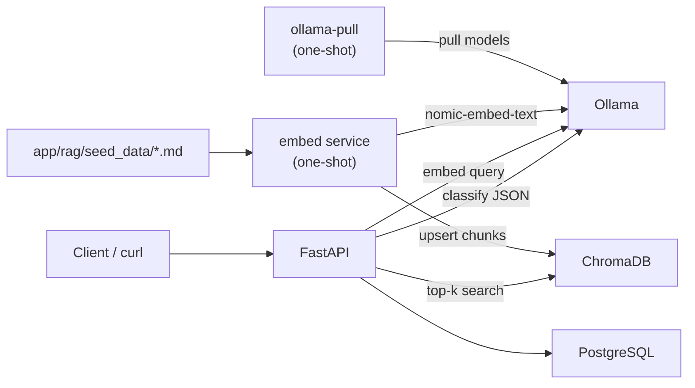

# CloudNova Ticket Triage (RAG)

A **fully self-hosted** support-ticket triage demo that uses RAG to classify
incoming tickets, draft answers from a product knowledge base, and escalate to a
human when confidence is low.

**No external API keys.** Chat and embeddings run on a local [Ollama](https://ollama.com)
instance inside Docker Compose.

## Problem statement

Support teams drown in repetitive questions that already exist in docs (billing,
login, API errors, FAQs). A plain LLM call can invent answers or sound confident
when it should escalate. This project shows a safer pattern:

1. Retrieve relevant doc chunks from a local vector store
2. Ask a local model to classify + score confidence against that context
3. Auto-draft a reply only when confidence clears a threshold
4. Otherwise mark the ticket `needs_human_review`

## Architecture



| Service       | Role                                                      |
|---------------|-----------------------------------------------------------|
| `ollama`      | Local LLM + embedding server (`:11434`, named volume)     |
| `ollama-pull` | First-run `ollama pull` for chat + embed models           |
| `chromadb`    | Vector store (persisted volume)                           |
| `embed`       | Chunk seed docs and index them via `nomic-embed-text`     |
| `postgres`    | Ticket persistence                                        |
| `api`         | FastAPI — starts only after models are pulled + indexed   |

### Models

| Role        | Model              | Env var              |
|-------------|--------------------|----------------------|
| Chat / triage | `llama3.1:8b`    | `OLLAMA_MODEL`       |
| Embeddings  | `nomic-embed-text` | `OLLAMA_EMBED_MODEL` |

**Why `llama3.1:8b` (not a 3B-class model)?**  
Triage needs reliable **structured JSON** (category + confidence + optional
draft). Smaller 3B models are faster but miss fields, invent categories, or
break JSON more often. 8B is a deliberate reliability tradeoff for this demo.

### Project layout

```
app/
  api/                 # /health, /debug/retrieve, /tickets
  rag/
    seed_data/         # 12 CloudNova support markdown docs
    embed.py           # chunk + Ollama embed + Chroma upsert
    retrieve.py        # top-k similarity search
  agent/triage.py      # ChatOllama classification + drafting
  models/              # SQLAlchemy + Pydantic schemas
scripts/
  pull_ollama_models.sh
```

## Setup

Prerequisites: Docker + Docker Compose. **No API keys.**

> First boot downloads models into the `ollama_data` volume (~5GB for
> `llama3.1:8b` plus ~270MB for `nomic-embed-text`). Later starts reuse the volume.

```bash
cp .env.example .env
docker compose up --build
```

Boot order:

1. `postgres`, `chromadb`, and `ollama` start
2. `ollama-pull` runs `ollama pull llama3.1:8b` and `ollama pull nomic-embed-text`
3. `embed` indexes `app/rag/seed_data/*.md` into Chroma via Ollama embeddings
4. `api` serves traffic

Re-index after editing seed docs:

```bash
docker compose run --rm embed python -m app.rag.embed --force
```

Re-pull / swap models (example: change `OLLAMA_MODEL` in `.env` first):

```bash
docker compose run --rm ollama-pull
```

API: `http://localhost:8000` · Docs: `http://localhost:8000/docs` · Ollama: `http://localhost:11434`

## Example requests

### Health

```bash
curl -s http://localhost:8000/health | jq
```

### Debug retrieval

```bash
curl -s -X POST http://localhost:8000/debug/retrieve \
  -H 'Content-Type: application/json' \
  -d '{"query": "how do I reset my 2FA", "k": 4}' | jq
```

Expect top chunks from `login-2fa.md` (category `login`).

### Create a ticket (RAG + local classification)

```bash
curl -s -X POST http://localhost:8000/tickets \
  -H 'Content-Type: application/json' \
  -d '{
    "subject": "Lost authenticator",
    "body": "How do I reset my 2FA on CloudNova after getting a new phone?"
  }' | jq
```

```bash
curl -s -X POST http://localhost:8000/tickets \
  -H 'Content-Type: application/json' \
  -d '{
    "subject": "Custom ERP connector",
    "body": "Build a bi-directional SAP sync with 50ms latency SLA."
  }' | jq
```

### List tickets

```bash
curl -s http://localhost:8000/tickets | jq
```

## Configuration

| Variable               | Default             | Purpose                         |
|------------------------|---------------------|---------------------------------|
| `OLLAMA_MODEL`         | `llama3.1:8b`       | Chat / classification model     |
| `OLLAMA_EMBED_MODEL`   | `nomic-embed-text`  | Embedding model for Chroma      |
| `CONFIDENCE_THRESHOLD` | `0.7`               | Auto-resolve cutoff             |
| `POSTGRES_*`           | `triage`            | Database credentials            |

There is **no** `OPENAI_API_KEY` (or any other vendor key) in this project.

## Design decisions

### Why RAG instead of a plain LLM call?

A plain prompt has no product ground truth. RAG injects real docs so answers are
attributable to retrieved chunks (inspectable via `/debug/retrieve`).

### Why confidence-based escalation?

Wrong automation is worse than no automation. Below `CONFIDENCE_THRESHOLD` the
system refuses to guess: status becomes `needs_human_review` and drafted replies
are discarded.

### Why fully local Ollama?

Keeps the portfolio demo runnable with `docker compose up` and nothing else —
no signup, no billing, no leaked keys in `.env`. Chat uses LangChain
`ChatOllama` at `http://ollama:11434`; embeddings use `OllamaEmbeddings` with
`nomic-embed-text`.
