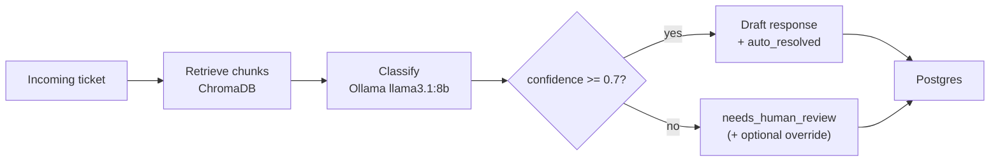

# Ticket Triage RAG

A self-hosted support ticket triage system using retrieval-augmented generation and confidence-based human escalation.

## Problem statement

Most support volume is repetitive questions already answered in product docs—password resets, failed charges, API 429s. Auto-replying with a plain LLM is risky: the model can invent policy details or sound sure when the docs don’t cover the case. Always routing to a human is safer but wastes agent time on tickets the docs already solve. This project sits in the middle: retrieve relevant docs, classify with a confidence score, draft a reply only when that score clears a threshold, and escalate everything else for human review.

## Architecture



## Quickstart

```bash
git clone https://github.com/Pratanu123/ticket-triage-rag.git
cd ticket-triage-rag
cp .env.example .env
docker compose up --build
```

No API keys. On first run the `ollama-pull` service downloads `llama3.1:8b` and `nomic-embed-text` into a named volume (~5–10 minutes depending on network). Later starts reuse that volume.

| Surface | URL |
|---------|-----|
| Dashboard UI | http://localhost:8080 |
| API | http://localhost:8000 |
| API docs | http://localhost:8000/docs |
| Grafana | http://localhost:3000 |
| pgAdmin | http://localhost:5050 |
| OpenSearch Dashboards | http://localhost:5601 |

The UI proxies `/api/*` to the FastAPI service through nginx, so the browser never talks to the backend origin directly (no CORS setup).

> Screenshot: add a dashboard capture here after a local run (ticket list with confidence bars + status badges, and a detail view with override).

## Observability & Admin Tools

| Tool | Port | Purpose |
|------|------|---------|
| **pgAdmin** | http://localhost:5050 | Inspect raw Postgres data (`tickets` table, enums, history). Login with `PGADMIN_EMAIL` / `PGADMIN_PASSWORD` from `.env`. The Postgres server is pre-loaded via `servers.json`. |
| **OpenSearch Dashboards** | http://localhost:5601 | Search and audit ticket history indexed on create/override. Separate from RAG retrieval (which searches the knowledge base). |
| **Grafana** | http://localhost:3000 | System metrics: request latency, LLM classify/respond duration, auto-resolved vs escalated outcomes. Login with `GRAFANA_ADMIN_USER` / `GRAFANA_ADMIN_PASSWORD`. Dashboard **Ticket Triage Overview** is provisioned automatically. |
| **Prometheus** | http://localhost:9090 | Scrapes FastAPI `/metrics`. |

OpenSearch is tuned for a laptop (`OPENSEARCH_JAVA_OPTS=-Xms512m -Xmx512m`, single-node, security plugin disabled). On lower-memory machines, stop Ollama when you are not actively testing triage:

```bash
docker compose stop ollama
```

That frees several GB of RAM for OpenSearch/Grafana while you still browse pgAdmin, search, and dashboards.

Ticket audit search API (OpenSearch-backed):

```bash
curl -s 'http://localhost:8000/tickets/search?q=2FA' | jq
```

## Example usage

### Auto-resolved ticket (clear login / 2FA question)

```bash
curl -s -X POST http://localhost:8000/tickets \
  -H 'Content-Type: application/json' \
  -d '{
    "subject": "I cannot log in",
    "body": "I cannot log in, 2FA is not working after I got a new phone. How do I reset it?"
  }'
```

Example response:

```json
{
  "id": "3f2a9c1e-8b4d-4e6a-9c21-7a1d0e5b8f33",
  "subject": "I cannot log in",
  "body": "I cannot log in, 2FA is not working after I got a new phone. How do I reset it?",
  "category": "login",
  "confidence": 0.91,
  "status": "auto_resolved",
  "suggested_response": "Sorry about the lockout. If you still have a backup code, use it on the login screen (Use a backup code), then go to Settings → Security → Two-factor authentication, disable 2FA, and set it up again on your new phone. According to login-2fa.md, a workspace admin can also reset your 2FA from Settings → Team if you have no backup codes.",
  "reasoning": "The ticket clearly describes a 2FA recovery scenario after a device change, which matches the login-2fa knowledge base article.",
  "retrieved_chunks": [
    {
      "content": "## Reset or recover 2FA\nIf you lost your authenticator device:\n1. Use a backup code on the login screen...",
      "source": "login-2fa.md",
      "category": "login",
      "chunk_index": 1,
      "score": 0.86
    }
  ],
  "created_at": "2026-07-19T20:15:01.120Z",
  "updated_at": "2026-07-19T20:15:01.120Z"
}
```

### Escalated ticket (vague / out of scope)

```bash
curl -s -X POST http://localhost:8000/tickets \
  -H 'Content-Type: application/json' \
  -d '{
    "subject": "Weird issue",
    "body": "Something feels off with my workspace but I am not sure what. Also can you build a custom SAP connector with 50ms latency?"
  }'
```

Example response:

```json
{
  "id": "a91e0b44-2c7f-4d18-8e55-0f3c6b9a1d20",
  "subject": "Weird issue",
  "body": "Something feels off with my workspace but I am not sure what. Also can you build a custom SAP connector with 50ms latency?",
  "category": "general",
  "confidence": 0.28,
  "status": "needs_human_review",
  "suggested_response": null,
  "reasoning": "The request mixes an unspecified workspace issue with a custom ERP integration that is not covered by the knowledge base. Confidence is low; escalating instead of guessing.",
  "retrieved_chunks": [
    {
      "content": "## Contact support\n- Starter/Pro: support@cloudnova.example...",
      "source": "faq-support-and-data.md",
      "category": "faq",
      "chunk_index": 0,
      "score": 0.41
    }
  ],
  "created_at": "2026-07-19T20:16:12.004Z",
  "updated_at": "2026-07-19T20:16:12.004Z"
}
```

### Human override (escalation is not a dead end)

```bash
curl -s -X POST http://localhost:8000/tickets/a91e0b44-2c7f-4d18-8e55-0f3c6b9a1d20/override \
  -H 'Content-Type: application/json' \
  -d '{
    "suggested_response": "Thanks for reaching out. Custom SAP sync is outside self-serve support — I have routed this to our integrations team, who will follow up within one business day. If you can share any concrete error messages about the workspace issue separately, that helps us triage faster.",
    "category": "general",
    "note": "Out-of-scope integration; handed to integrations queue"
  }'
```

Example response:

```json
{
  "id": "a91e0b44-2c7f-4d18-8e55-0f3c6b9a1d20",
  "subject": "Weird issue",
  "body": "Something feels off with my workspace but I am not sure what. Also can you build a custom SAP connector with 50ms latency?",
  "category": "general",
  "confidence": 0.28,
  "status": "human_resolved",
  "suggested_response": "Thanks for reaching out. Custom SAP sync is outside self-serve support — I have routed this to our integrations team, who will follow up within one business day. If you can share any concrete error messages about the workspace issue separately, that helps us triage faster.",
  "reasoning": "The request mixes an unspecified workspace issue with a custom ERP integration that is not covered by the knowledge base. Confidence is low; escalating instead of guessing.\n\n[human override] Out-of-scope integration; handed to integrations queue",
  "retrieved_chunks": [
    {
      "content": "## Contact support\n- Starter/Pro: support@cloudnova.example...",
      "source": "faq-support-and-data.md",
      "category": "faq",
      "chunk_index": 0,
      "score": 0.41
    }
  ],
  "created_at": "2026-07-19T20:16:12.004Z",
  "updated_at": "2026-07-19T20:17:44.551Z"
}
```

## Design decisions

### Why RAG instead of a plain LLM call

A prompt-only model has no product ground truth. Asked about refund windows or API error codes, it will often invent plausible answers. RAG pulls the actual markdown docs into the prompt and stores the retrieved chunks on the ticket, so a reviewer can see what the model saw. That does not eliminate hallucination, but it ties answers to specific sources (`login-2fa.md`, `api-rate-limits.md`) instead of model memory.

### Why confidence-based escalation

Wrong automation is worse than no automation. If the system always auto-replies, ambiguous tickets get confident nonsense. If it never auto-replies, the demo is just a search box. The classifier returns an explicit confidence score; below the threshold we set `needs_human_review` and skip drafting entirely. `POST /tickets/{id}/override` exists so escalation is a handoff, not a dead end.

### Why local Ollama instead of a hosted API

Anyone cloning the repo can run `docker compose up` with no signup, billing, or leaked keys in `.env`. Chat uses `llama3.1:8b` and embeddings use `nomic-embed-text`, both served from the `ollama` Compose service. The 8B chat model was chosen over 3B-class options because triage needs reliable structured JSON (category + confidence); smaller models break that format more often. Trade-off: first boot downloads ~5GB and inference is slower than a hosted API.

### Why this chunking / retrieval strategy

Seed docs are split primarily on `##` / `###` headings, then hard-capped around ~2000 characters so oversized sections don’t become one embedding. That keeps chunks aligned with how the docs were written, which works well for this small FAQ corpus. Trade-offs: heading-based splits can still mix unrelated bullets under one section, and we only take top-k=4 by cosine similarity—no reranker, no hybrid BM25. For 12 short markdown files that is enough; for a large messy wiki it would not be.

### Why a confidence threshold of 0.7

`CONFIDENCE_THRESHOLD` defaults to `0.7`. That is a tunable knob, not a calibrated probability. The model’s score is self-reported, so treating 0.7 as “70% accurate in production” would be wrong. Empirically, clear doc-backed tickets (password reset, 2FA, rate limits) land above it, and vague or out-of-scope tickets land below. In a real deployment you would measure precision/recall on labeled tickets and move the threshold—or replace the scalar with a calibrated model.

## What I'd do differently at scale

- Replace local ChromaDB with a managed vector store (or pgvector in the same Postgres) once the corpus and QPS grow past a single-node demo.
- Cache embeddings and frequent retrieval results for repeated subjects (“reset password”) to cut Ollama load.
- Log human overrides as labeled feedback and periodically retune the threshold (or train a small classifier on override outcomes).
- Add tracing around retrieve → classify → respond (latency, token counts, parse retries) so failures are debuggable in production, not just via `docker compose logs`.

## Tech stack

- **API:** Python 3.11, FastAPI, Pydantic, SQLAlchemy (async)
- **UI:** React + Vite + Tailwind (nginx in Compose, `:8080`)
- **LLM / embeddings:** Ollama (`llama3.1:8b`, `nomic-embed-text`) via LangChain
- **Vector store:** ChromaDB (Docker volume)
- **Ticket search / audit:** OpenSearch + Dashboards
- **Database:** PostgreSQL 16 (+ pgAdmin)
- **Metrics:** Prometheus + Grafana (`prometheus-fastapi-instrumentator`)
- **Orchestration:** Docker Compose
- **Tests:** pytest (run inside Compose against real services)

## Running tests

With the stack up (or after dependencies are healthy):

```bash
docker compose run --rm api pytest -v
```

Classification tests hit the real local Ollama model on purpose; the set is kept small so the suite stays practical.
