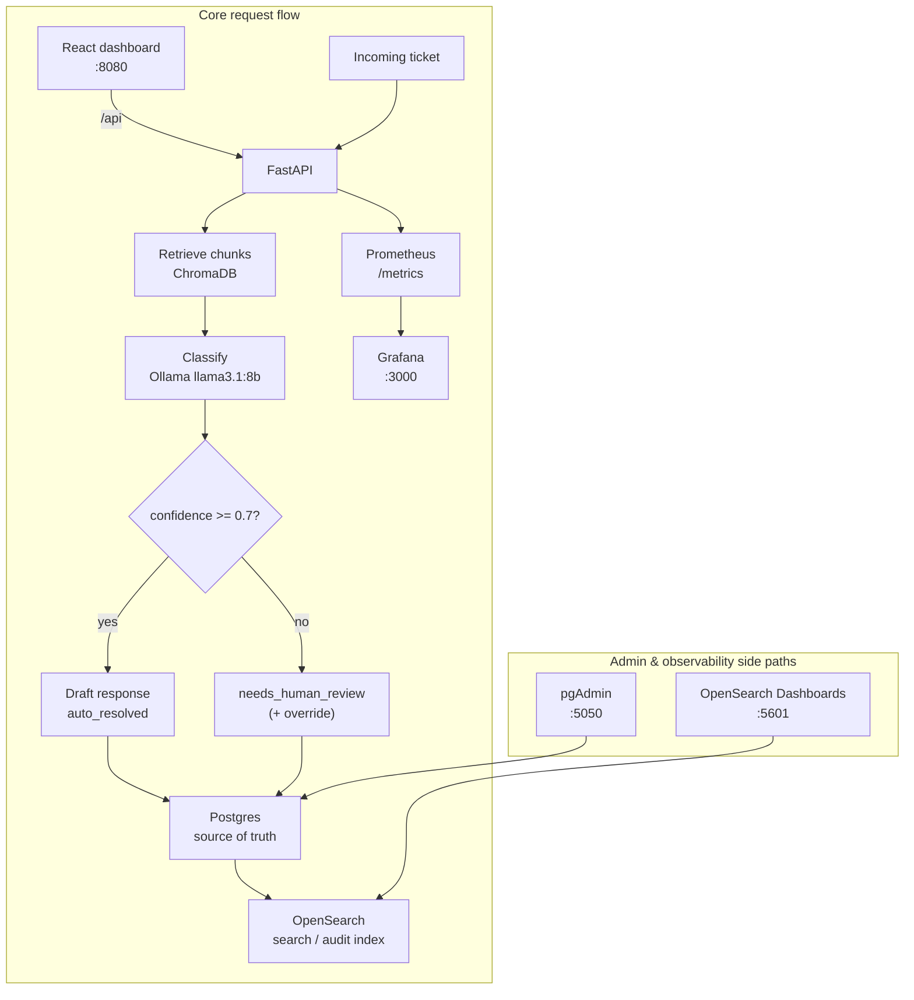

# Ticket Triage RAG

A self-hosted support ticket triage system using retrieval-augmented generation, confidence-based human escalation, and full observability, running entirely locally with no external API keys.

## Problem statement

Support volume is dominated by questions already answered in product docs—password resets, failed charges, API rate limits. Auto-replying with an ungrounded LLM invents policy details; always paging a human wastes time on tickets the docs already solve. This system retrieves relevant docs, classifies with an explicit confidence score, drafts a reply only above a threshold, and escalates the rest. For anything closer to production than a notebook, that path also needs an audit trail and metrics: you must be able to search what the system decided, and see when LLM latency or escalation rate drifts.

## Architecture



## Quickstart

```bash
git clone https://github.com/Pratanu123/ticket-triage-rag.git
cd ticket-triage-rag
cp .env.example .env
docker compose up --build
```

First run pulls Ollama models (`llama3.1:8b`, `nomic-embed-text`) into a named volume — typically 5–10 minutes depending on network. OpenSearch and Grafana often become healthy later than the API/UI; check readiness with:

```bash
docker compose ps
curl -s http://localhost:8000/health | jq
```

When `api` is healthy and the frontend responds on `:8080`, the core path is ready. Admin tools may still be starting.

## Using the app

**Dashboard:** [http://localhost:8080](http://localhost:8080)

Walkthrough:

1. Open the UI and click **New Ticket**.
2. Submit something clear (e.g. 2FA reset after a new phone). Watch the loading state while local Ollama classifies — this can take a few seconds.
3. Land on the detail view: category, confidence bar, reasoning, retrieved source docs, and either a drafted reply (`auto_resolved`) or an empty review form (`needs_human_review`).
4. For escalated tickets, edit the response and click **Approve and send** (calls `POST /tickets/{id}/override`).

| Surface | URL |
|---------|-----|
| Dashboard UI | http://localhost:8080 |
| API | http://localhost:8000 |
| API docs | http://localhost:8000/docs |

## Admin & observability tools

| Tool | URL | Purpose |
|------|-----|---------|
| pgAdmin | http://localhost:5050 | Inspect raw Postgres data (`tickets` table, status/category enums). |
| OpenSearch Dashboards | http://localhost:5601 | Full-text search and audit trail across ticket history (indexed on create/override). |
| Grafana | http://localhost:3000 | Request latency, LLM classify/respond duration, auto-resolved vs escalated ratio. Dashboard **Ticket Triage Overview** is provisioned on boot. |
| Prometheus | http://localhost:9090 | Scrapes FastAPI `/metrics`; mostly consumed by Grafana. |

Default credentials for pgAdmin and Grafana are defined in `.env.example` (`PGADMIN_EMAIL` / `PGADMIN_PASSWORD`, `GRAFANA_ADMIN_USER` / `GRAFANA_ADMIN_PASSWORD`). Copy to `.env` and change them if you expose the stack beyond localhost.

## Example API usage

### Auto-resolved ticket

```bash
curl -s -X POST http://localhost:8000/tickets \
  -H 'Content-Type: application/json' \
  -d '{
    "subject": "I cannot log in",
    "body": "I cannot log in, 2FA is not working after I got a new phone. How do I reset it?"
  }'
```

```json
{
  "id": "3f2a9c1e-8b4d-4e6a-9c21-7a1d0e5b8f33",
  "subject": "I cannot log in",
  "body": "I cannot log in, 2FA is not working after I got a new phone. How do I reset it?",
  "category": "login",
  "confidence": 0.91,
  "status": "auto_resolved",
  "suggested_response": "Sorry about the lockout. If you still have a backup code, use it on the login screen (Use a backup code), then go to Settings → Security → Two-factor authentication, disable 2FA, and set it up again on your new phone. According to login-2fa.md, a workspace admin can also reset your 2FA from Settings → Team if you have no backup codes.",
  "reasoning": "The ticket clearly describes a 2FA recovery scenario after a device change, which matches the login-2fa knowledge base article.",
  "retrieved_chunks": [
    {
      "content": "## Reset or recover 2FA\nIf you lost your authenticator device:\n1. Use a backup code on the login screen...",
      "source": "login-2fa.md",
      "category": "login",
      "chunk_index": 1,
      "score": 0.86
    }
  ],
  "created_at": "2026-07-19T20:15:01.120Z",
  "updated_at": "2026-07-19T20:15:01.120Z"
}
```

### Escalated ticket

```bash
curl -s -X POST http://localhost:8000/tickets \
  -H 'Content-Type: application/json' \
  -d '{
    "subject": "Weird issue",
    "body": "Something feels off with my workspace but I am not sure what. Also can you build a custom SAP connector with 50ms latency?"
  }'
```

```json
{
  "id": "a91e0b44-2c7f-4d18-8e55-0f3c6b9a1d20",
  "subject": "Weird issue",
  "body": "Something feels off with my workspace but I am not sure what. Also can you build a custom SAP connector with 50ms latency?",
  "category": "general",
  "confidence": 0.28,
  "status": "needs_human_review",
  "suggested_response": null,
  "reasoning": "The request mixes an unspecified workspace issue with a custom ERP integration that is not covered by the knowledge base. Confidence is low; escalating instead of guessing.",
  "retrieved_chunks": [
    {
      "content": "## Contact support\n- Starter/Pro: support@cloudnova.example...",
      "source": "faq-support-and-data.md",
      "category": "faq",
      "chunk_index": 0,
      "score": 0.41
    }
  ],
  "created_at": "2026-07-19T20:16:12.004Z",
  "updated_at": "2026-07-19T20:16:12.004Z"
}
```

### Human override

```bash
curl -s -X POST http://localhost:8000/tickets/a91e0b44-2c7f-4d18-8e55-0f3c6b9a1d20/override \
  -H 'Content-Type: application/json' \
  -d '{
    "suggested_response": "Thanks for reaching out. Custom SAP sync is outside self-serve support — I have routed this to our integrations team, who will follow up within one business day.",
    "category": "general",
    "note": "Out-of-scope integration; handed to integrations queue"
  }'
```

```json
{
  "id": "a91e0b44-2c7f-4d18-8e55-0f3c6b9a1d20",
  "status": "human_resolved",
  "suggested_response": "Thanks for reaching out. Custom SAP sync is outside self-serve support — I have routed this to our integrations team, who will follow up within one business day.",
  "reasoning": "The request mixes an unspecified workspace issue with a custom ERP integration that is not covered by the knowledge base. Confidence is low; escalating instead of guessing.\n\n[human override] Out-of-scope integration; handed to integrations queue",
  "confidence": 0.28,
  "category": "general"
}
```

### Ticket history search (OpenSearch)

```bash
curl -s 'http://localhost:8000/tickets/search?q=2FA' | jq
```

```json
{
  "query": "2FA",
  "total": 1,
  "hits": [
    {
      "ticket_id": "3f2a9c1e-8b4d-4e6a-9c21-7a1d0e5b8f33",
      "subject": "I cannot log in",
      "category": "login",
      "confidence": 0.91,
      "status": "auto_resolved",
      "reasoning": "The ticket clearly describes a 2FA recovery scenario after a device change, which matches the login-2fa knowledge base article.",
      "event": "created",
      "timestamp": "2026-07-19T20:15:01.120000+00:00",
      "score": 4.12
    }
  ]
}
```

This searches the ticket audit index, not the knowledge base. RAG retrieval for docs is separate (`POST /debug/retrieve`).

## Design decisions

### Why RAG instead of a plain LLM call

A prompt-only model has no product ground truth. Asked about refund windows or API error codes, it fills gaps with plausible fiction. RAG injects the actual markdown docs and stores retrieved chunks on the ticket, so answers cite sources (`login-2fa.md`, `api-rate-limits.md`) and a reviewer can see what the model saw.

### Why confidence-based escalation

Wrong automation is worse than no automation. Always auto-replying produces confident nonsense on ambiguous tickets; never auto-replying is just a search UI. The classifier returns an explicit score; below the threshold we set `needs_human_review` and skip drafting. `POST /tickets/{id}/override` makes escalation a handoff, not a dead end.

### Why local Ollama instead of a hosted API

`docker compose up` should work with no signup, billing, or keys in `.env`. Chat uses `llama3.1:8b` (chosen over 3B-class models for more reliable structured JSON); embeddings use `nomic-embed-text`. Trade-off: first boot downloads ~5GB and inference is slower than a hosted API.

### Why OpenSearch alongside Postgres

Postgres is the source of truth for ticket rows. OpenSearch holds a denormalized audit/search document (subject, category, confidence, status, reasoning, timestamps) updated on create and override. You could get by with Postgres full-text search for this corpus size; OpenSearch is here for proper ticket-history search UX and as an explicit audit index — partly a deliberate separation of concerns / skill demonstration, not the only correct design.

### Why Prometheus and Grafana instead of logs alone

LLM calls dominate latency. Request logs tell you something failed; histograms for classify vs respond duration and counters for `auto_resolved` / `needs_human_review` show whether the system is slow or suddenly escalating more. Grafana’s provisioned dashboard makes that visible without scraping `/metrics` by hand.

### Why a confidence threshold of 0.7

`CONFIDENCE_THRESHOLD` defaults to `0.7`. It is a tunable knob, not a calibrated probability. The model’s score is self-reported; treating 0.7 as “70% accurate in production” would be wrong. Clear doc-backed tickets tend to land above it; vague or out-of-scope ones below. In a real deployment you would measure precision/recall on labeled tickets and move the threshold.

## What I'd do differently at scale

- Replace local ChromaDB with a managed vector store (or pgvector in the same Postgres) once corpus size and QPS grow.
- Serve models from a dedicated inference stack (vLLM, TGI, or a managed endpoint) instead of Ollama-in-Compose; Ollama is convenient for a laptop, not a multi-replica API tier.
- Make triage async: accept the ticket, enqueue classify/respond, and push results when ready — synchronous HTTP waits on LLM time and does not scale under burst load.
- Add Grafana alerting (escalation rate spikes, classify p95 budget) instead of dashboards that only get watched when someone remembers to open them.
- Treat LLM inference as the horizontal bottleneck: scale model replicas independently from the API, and cache embeddings / frequent retrieval queries.

## Tech stack

**Backend**
- Python 3.11, FastAPI, Pydantic, SQLAlchemy (async), pytest

**AI / RAG**
- Ollama (`llama3.1:8b`, `nomic-embed-text`), LangChain, ChromaDB

**Frontend**
- React, Vite, Tailwind CSS, nginx (proxies `/api` → FastAPI)

**Data**
- PostgreSQL 16, OpenSearch 2.x

**Observability**
- Prometheus, Grafana, pgAdmin, OpenSearch Dashboards, `prometheus-fastapi-instrumentator`

## Running tests

With Compose dependencies healthy:

```bash
docker compose run --rm api pytest -v
```

Classification tests hit the real local Ollama model; that set is kept small on purpose.

## Resource notes

This stack runs on the order of ~10 long-lived containers (API, UI, Postgres, Chroma, Ollama, OpenSearch + Dashboards, Prometheus, Grafana, pgAdmin), plus one-shot pull/embed jobs on boot. OpenSearch is capped for a laptop (`OPENSEARCH_JAVA_OPTS=-Xms512m -Xmx512m`, single-node, security plugin disabled).

When you only need the UI and API against an already-indexed knowledge base, free RAM with:

```bash
docker compose stop ollama opensearch opensearch-dashboards
```

Bring them back with `docker compose start ollama opensearch opensearch-dashboards` (and re-run `ollama-pull` / wait for health if models or search are needed again).
